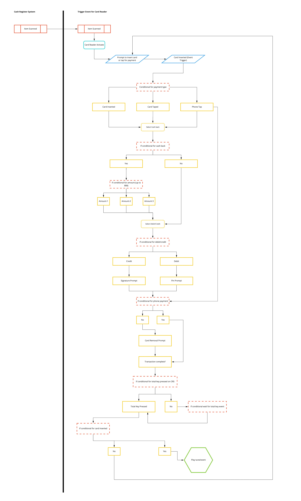

# Play-the-music

## Author

- Jason Taisey

## Version

- 1.0.0, 08/19/2021: Create the read-me portion of the application and push up the first commit

- 1.1.0, 08/20/2021: Added the wire-frame to the project for road-mapping

- 1.1.1, 08/20/2021: Created the testing folder and function for start of the transaction

- 1.1.2, 08/20/2021: Added in the files to test the program, and created the first test

- 1.1.3, 08/20/2021: Updated the test for the card reader

- 1.1.4, 08/20/2021: Restructured files, and created the card reader triggers

- 1.1.5, 08/20/2021: Conditional event for card reader to determine what payment type used

- 1.1.6, 08/20/2021: Conditional for the cashback amounts added

- 1.1.7, 08/20/2021: Transaction conditionals added to the appropriate functions

- 1.2.0, 08/23/2021: Debit and Credit card functions created

- 1.2.1, 08/23/2021: Debit and Credit card functions refactored and separated into two functions

- 1.2.2, 08/23/2021: Created the phone tap payment option

- 1.2.1, 08/26/2021: Card removal prompt added

- 1.2.1, 08/26/2021: Created the total key action to trigger the transaction completion

- 1.2.1, 08/26/2021: Refactoring code to improve call stack

- 1.3.1. 08/27/2021: Refactoring the code and making notes of the call stack

## About the Application

- I created this application as a way for card readers to play music, a blurb, or some type of response back when cards or phone tap event occurs. My inspiration for the application comes from shopping at trader Joes and when the transaction is complete a little tune is played at the end. 

## Problem Domain

- As a user I would like the tune or response to persist for a set amount of time after the card or phone tap event takes place. The solution is to set up a conditional event that will trigger the tune or response to play for a set interval.

## Wireframes

## Call Stack

- Function tiggerReader activates the start of the transaction with an onkeypress. The onkeypress calls the transactionStart function which is evaluated as true. The evaluation of true will help other functions latter in the call stack

- Once the transactionStart function is called the edge case for the triggerReader is used to check and make sure the item was scanned

- As the transactionStart is called this activates the itemScan function to prompt the card reader to display "Insert card, tap card or tap phone"

